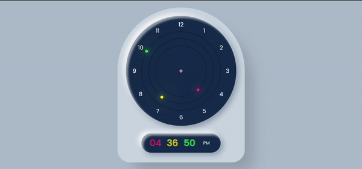

# Analog & Digital Clock

A working analog and digital clock created using HTML, CSS, and JavaScript. This project features a functional, animated clock with both analog and digital displays.

## Demo

Here’s a preview of how the clock looks:



## Features

- **Analog Clock**: Shows the current time with animated hour, minute, and second hands.
- **Digital Clock**: Displays the current time in hours, minutes, and seconds with AM/PM format.
- **Smooth Animations**: The hands of the analog clock move smoothly, and the digital clock updates every second.
- **Responsive Design**: The clock adjusts to fit different screen sizes.

## How It Works

- The **Analog Clock** uses CSS transformations to rotate the hour, minute, and second hands based on the current time.
- The **Digital Clock** updates the time every second using JavaScript's `setInterval` and the `Date` object to get the current time.

## Project Structure

```bash
.
├── assets/               # Contains images and media files
│   └── clock.gif         # Clock animation preview
├── index.html            # Main HTML structure for the clock
├── style.css             # Styling for the analog and digital clock
└── README.md             # This file
```

## Getting Started
### Prerequisites
You just need a web browser to view this project.

### Running the Project
1. Clone the repository:
    ```bash
    git clone https://github.com/megamiii/AnalogDigitalClock.git
    ```
2. Navigate to the project directory:
   ```bash
   cd AnalogDigitalClock
   ```
3. Open `index.html` in your browser:
   ```bash
    open index.html
   ```

## Technologies Used

- **HTML5**: Markup language for creating the structure of the clock.
- **CSS3**: Used for styling the clock, including the clock face, hands, and background effects.
- **JavaScript**: Handles the time calculations and updates the positions of the hands on the analog clock and updates the digital display.

## Acknowledgment

This project was built by following the tutorial video ["Working Analog and Digital Clock using HTML, CSS & JavaScript"](https://youtu.be/5NbczsfBe4I) by [Online Tutorials](https://www.youtube.com/@OnlineTutorialsYT).